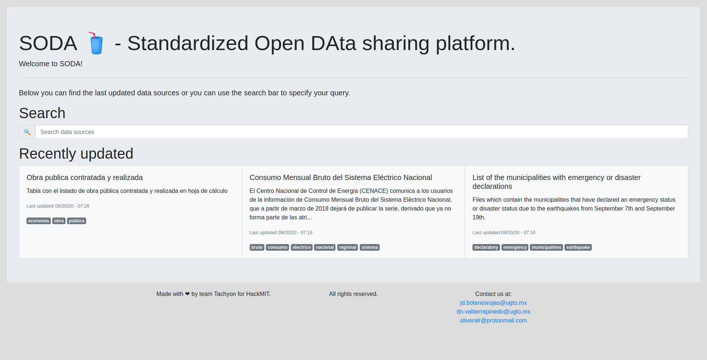
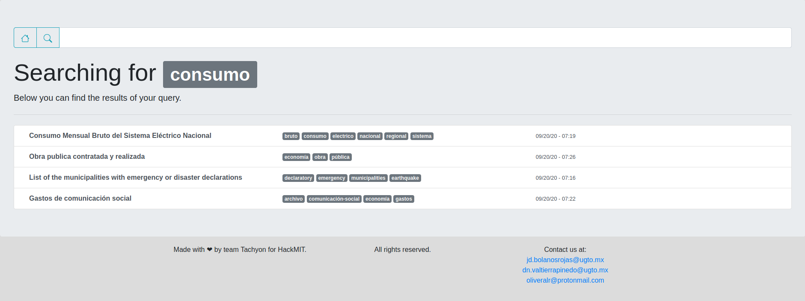
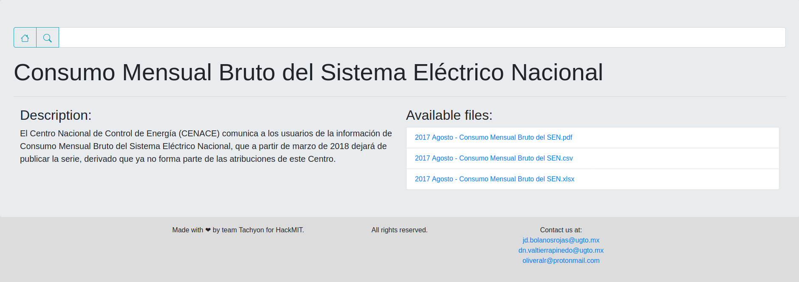

# SODA
Standardized Open DAta sharing platform. 

Made with :heart: by team Tachyon for HackMIT.

## Description
SODA is a server software which makes it easy and straightforward to publish data sources and datasets in various formats on the Internet. It does so by reading the directory structure of a base directory specified by the administrator and its files. Afterward, the user of the deployed website can use the search function to find a specific source in an accesible and easy way.

### Screenshots




## Requirements
- Python^3.8
- pipenv
- flask (installed by pipenv)
- python-dotenv (installed by pipenv)

## Installation
Clone the repository and run pipenv to install the dependencies. Afterward run `flask run --host=[hostname]` to start the server. Make sure to read the [config](#config) section before the first run.

## Config
To select a base content directories create a `.env` file inside the repository root folder and add the environment variable `DIR=[path to directory containing the soda_-_files directory as described below]`. Make sure to read the [Adding entries](#adding-entries) section to add data source entries to your server.

### Adding entries
To add entries to your server, make sure to create the following directory structure starting at your `soda_files` directory:

- `soda_files`
  - `data_sources`
    - `Entry Name 1`
        - **`description.txt`**
        - **`tags.txt`**
        - `files`
          - `data_file.csv`
          - `data_file.xlsx`
          - `data_file.tsv`
    - `Entry Name 2`
        - **`description.txt`**
        - **`tags.txt`**
        - `files`
          - `data_file.csv`
          - `data_file.xlsx`
          - `data_file.tsv`

Each `Entry Name` directory must be named as it is expected to be displayed on the web-page.

> **Note**: It is **required** to create the `description.txt` and `tags.txt` files within each data source or the server might not be able to index the data source correctly. 

#### About `tags.txt` and `description.txt`
The `tags.txt` and `description.txt` files must have a specific format:

`tags.txt`

It must contain the tags of the data source each on a new line:
```txt
tag1
tag2
tag3
```

`description.txt`
It must contain the data source's description. It only allows Unicode characters to be displayed and currently does not support plain-text formatting (Markdown, ReStructuredText, ...).